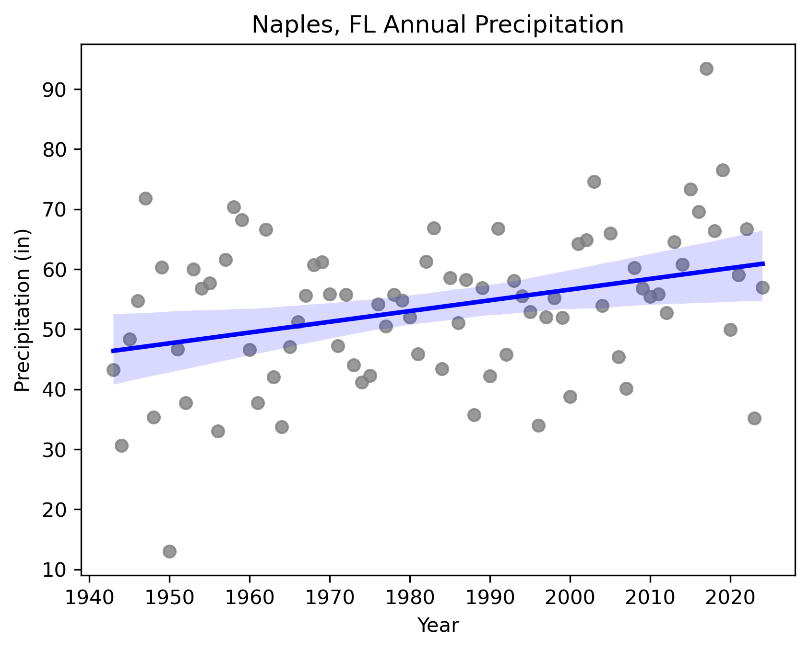

## Ben Ouaou
Hello! My name is Ben Ouaou (pronounced "whoa") and I am a senior undergraduate studying geography with a GIS track at University of Colorado Boulder. I also have some background in biology/botany/ecology. Through the Earth Analytics Data Science Bootcamp, I'm interested in learning basic data science and programming skills to pair with my GIS knowledge. I am originally from South Florida, and in my free time I love to write, play/see music, ski, and watch sports.

#### Contact Information
* Email
* LinkedIn
* [GitHub](https://github.com/bwhoa2299)

## Projects

### Map of Baltimore Sports Stadiums
<embed type="text/html" src="bmore.html" width="600" height="600">

### Precipitation Trends in Naples, FL

Many experts have correlated global climate change to increases in intense precipitation and extreme weather events, particularly as the warming of the Earth allows for the atmosphere to hold more water vapor (Center for Climate and Energy Solutions, 2019). In my hometown of Naples, FL, this change typically manifests as the increase of more intense hurricanes and rainfall events, though not necessarily as an increase in total yearly precipitation. The above linear regression model uses precipitation data taken by the NOAA NCEI, and more specifically at station USC00086078 in Naples, FL. The data was collected daily at this land-based station and was summed to represent total precipitation values for each year between 1943 and 2024. Though it does not account for intensity of precipitation, the plot shows that total precipitation in Naples has in fact increased over time. Whether this total increase in precipitation can be attributed to climate change, or whether it results from a combination of other factors, including surrounding oceanic effects, may require further research.

#### References
Center for Climate and Energy Solutions. (2019, July 12). Extreme Precipitation and Climate Change | Center for Climate and Energy Solutions. Center for Climate and Energy Solutions. https://www.c2es.org/content/extreme-precipitation-and-climate-change/

Climate Indicators - Precipitation - Southeast Florida Regional Climate Compact. (2025, July 23). Southeast Florida Regional Climate Compact. https://southeastfloridaclimatecompact.org/initiative/climate-indicators-precipitation/

‌Menne, Matthew J., Imke Durre, Bryant Korzeniewski, Shelley McNeill, Kristy Thomas, Xungang Yin, Steven Anthony, Ron Ray, Russell S. Vose, Byron E.Gleason, and Tamara G. Houston (2012): Global Historical Climatology Network - Daily (GHCN-Daily), Version 3. Naples, FL station USC00086078 Precipitation Data. NOAA National Climatic Data Center. doi:10.7289/V5D21VHZ Accessed Sept. 23, 2025.
Matthew J. Menne, Imke Durre, Russell S. Vose, Byron E. Gleason, and Tamara G. Houston, 2012: An Overview of the Global Historical Climatology Network-Daily Database. J. Atmos. Oceanic Technol., 29, 897-910. doi:10.1175/JTECH-D-11-00103.1.

### [2023 Migration Patterns of the Cattle Egret (Bubulcus ibis)](egret-migration2.html)

### [An Vegetation Health Analysis of San Ildefonso Pueblo, NM](portfolio-post-2.html)

### [Konza Prarie: A Correlative Precipitation and Vegetation Health Analysis (Data Science Bootcamp Final Project)]()
